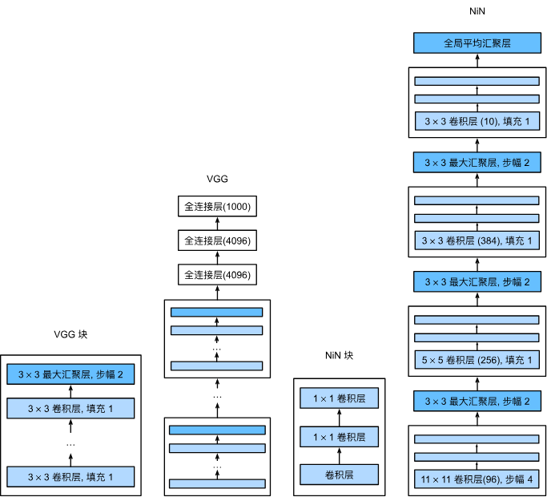

# NiN 复现

AlexNet、VGG都有一个共同的设计模式：通过一系列的卷积层与汇聚层来踢去空间结构特征，然后通过全连接层对特征的表征进行处理。AlexNet和VGG的主要内容是如何扩大和加深这两个模块。

但是如此使用全连接层可能会完全放弃表征的空间结构。而NiN网络提供了一个非常简单的解决方案：在每个像素的通道上分别使用多层感知机。

下图说明了VGG和NiN及他们的块之间的主要架构差异，NiN以一个普通卷积层开始，后面是两个$1\times1$的卷积层，这两个$1\times1$的卷积层充当带有ReLU激活函数的逐像素全连接层。最后通过平均池化层得到输出。

> 即通过$1\times1$卷积+池化层替代全连接层

